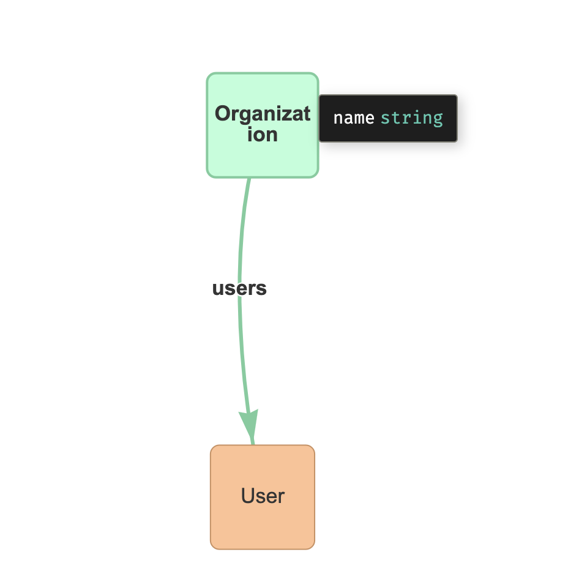

# 2022-dev-career-boost-handon

## 初期セットアップ

```sh
$ go mod init 2022-dev-career-boost-handon
$ go get -d entgo.io/ent/cmd/ent
```

## 1. Organization, Userスキーマを作成する

OrganizationとUserのスキーマを作成してみます。

```sh
$ go run -mod=mod entgo.io/ent/cmd/ent init Organization User
$ tree
.
├── README.md
├── ent
│   ├── generate.go
│   └── schema
│       ├── organization.go
│       └── user.go
├── go.mod
└── go.sum
```

作成されたテンプレートの中身はこんな感じ。

```sh
$ cat ent/schema/organization.go 
package schema

import "entgo.io/ent"

// Organization holds the schema definition for the Organization entity.
type Organization struct {
        ent.Schema
}

// Fields of the Organization.
func (Organization) Fields() []ent.Field {
        return nil
}

// Edges of the Organization.
func (Organization) Edges() []ent.Edge {
        return nil
}
```

Organizationに`name`フィールドを追加してみましょう。

```go
func (Organization) Fields() []ent.Field {
	return []ent.Field{
		field.String("name").
			Default("unknown"),
	}
}
```

次にOrganizationは複数のUserを持つこととしてみます。
entではEdgesとして表現されます。

```go
func (Organization) Edges() []ent.Edge {
	return []ent.Edge{
		edge.To("users", User.Type),
	}
}
```

同様にUserにも`name`フィールドとEdgeを追加してみましょう。
Userは必ずOrganizationに所属することとして、EdgeはRequired()されていることに注意してください。

```go
func (User) Fields() []ent.Field {
	return []ent.Field{
		field.String("name").
			Default("unknown"),
	}
}

func (User) Edges() []ent.Edge {
	return []ent.Edge{
		edge.From("organizations", Organization.Type).Ref("users").Required(),
	}
}
```

定義したスキーマに基づいてアセットを生成してみます。

```sh
$ go generate ./ent
$ tree
.
├── README.md
├── ent
│   ├── client.go
│   ├── config.go
│   ├── context.go
│   ├── ent.go
│   ├── enttest
│   │   └── enttest.go
│   ├── generate.go
│   ├── hook
│   │   └── hook.go
│   ├── migrate
│   │   ├── migrate.go
│   │   └── schema.go
│   ├── mutation.go
│   ├── organization
│   │   ├── organization.go
│   │   └── where.go
│   ├── organization.go
│   ├── organization_create.go
│   ├── organization_delete.go
│   ├── organization_query.go
│   ├── organization_update.go
│   ├── predicate
│   │   └── predicate.go
│   ├── runtime
│   │   └── runtime.go
│   ├── runtime.go
│   ├── schema
│   │   ├── organization.go
│   │   └── user.go
│   ├── tx.go
│   ├── user
│   │   ├── user.go
│   │   └── where.go
│   ├── user.go
|   ...
├── go.mod
└── go.sum
```

[公式ドキュメント](https://entgo.io/ja/docs/code-gen/#%E3%82%A2%E3%82%BB%E3%83%83%E3%83%88%E3%81%AE%E7%94%9F%E6%88%90)によると、このとき以下のアセットが生成されています。

- Client と Tx オブジェクトはグラフとのやり取りに使用されます。
- 各スキーマ型の CRUD ビルダー。 
- 各スキーマタイプのエンティティオブジェクト。
- ビルダーとの相互作用に使用される定数と述語を含むパッケージ。
- SQLの migrate パッケージ。 
- mutationミドルウェアを追加するためのhook パッケージ。

entvizを用いると、作成したスキーマを可視化することができます。

```sh
$ go get github.com/hedwigz/entviz/cmd/entviz
$ go run github.com/hedwigz/entviz/cmd/entviz ./ent/schema
$ open ./schema-viz.html
```



